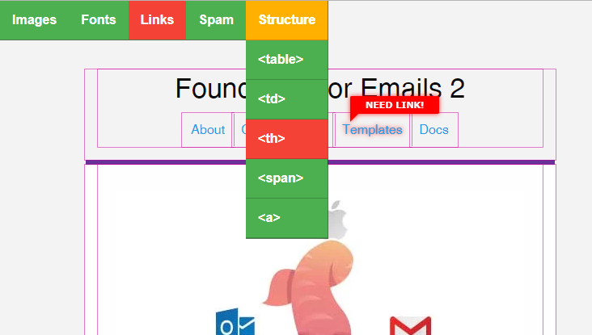

<p align="center">
  
</p>
<!--<h1 align="center">EmailTools</h1>-->
<p align="center">A cross-browser development tool for HTML email</p>

### Info
EmailTools allows you to see Image Alt styling, empty links and have a fast over of an HTML email WITHOUT touching the source code for the HTML.

**Note:** _Javascript NEEDs to come out of HTML for send-time through your Email Service Provider (ESP).

<p align="center">
  
</p>

### Goal of EmailTools
Aim to have a dynamic interface that does not touch the HTML in email that can assist design/development time. To also QA (Quality Assure) critical elements of HTML email code before deployment.

### Download
Download the latest release [here](https://github.com/YodaSpow/EmailDevTools/releases).

### Development
After forking/cloning put this code at bottom of your HTML body:
```
<script src="https://ajax.googleapis.com/ajax/libs/jquery/3.3.1/jquery.min.js"></script>
<link href="css/core.css" rel="stylesheet" type="text/css" />
<script src="scripts/core.js"></script>
```
### Integrated into HTML for sendtime automatic removal
You can put a data-driven IF statement from your ESP, using a primary key field in your send-data which is *never empty*: 
```
<!-- Email Tools -->
&lt;% if ( chainProfile.partyId == "") { %&gt;
<script src="https://ajax.googleapis.com/ajax/libs/jquery/3.3.1/jquery.min.js"></script>
<link href="http://somedomain.com/emailTool/core.css" rel="stylesheet" type="text/css" />
<script src="http://somedomain.com/emailTool/core.js"></script>
&lt;% } %&gt;
<!-- // -->
```
